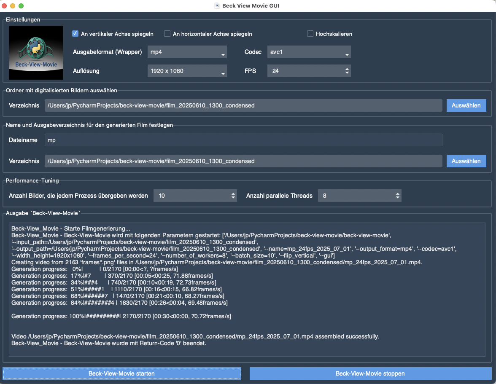

# Beck View Movie GUI

A user-friendly front‑end for the **beck‑view‑movie** tool—a GUI wrapper that allows you to easily select images and generate video files from them, similar in concept to **beck-view-gui**, which wraps **beck-view-digitalize**.


beck-view-movie-gui showing log-information after successfully finished assembling of digitised images.
---

## 🚀 Features

* **Graphical User Interface** for the [`beck-view-movie`](https://github.com/JuPfu/beck-view-movie) command-line tool.
* Provides **GUI widgets** for all available command-line options of `beck-view-movie`.
* Allows users to:

  * Select **input image folders**.
  * Set **output video file paths**.
  * Configure video parameters such as:
    * **Vertical or horizontal mirroring** of digitised images
    * **Frame rate**
    * **Resolution scaling**
    * **Codec options**
    * **Compression settings**
  * Configure performance options such as:
    * Number of **Parallel Threads** to run
    * **Batch-size of Image Frames** passed to each thread
* Assembles the selected values into a valid **command-line call**.
* On clicking **“Beck-View-Movie starten”**, the GUI launches `beck-view-movie` as a **subprocess** with all arguments passed correctly.
* Displays the **real-time console output** of the process in the GUI for user feedback.
* Provides a **Stop button** to terminate the running subprocess if needed.

---

## 🧰 Requirements

- Python **3.12+**
- Dependencies listed in `requirements.txt` (GUI framework, subprocess handling, etc.)
- [**beck-view-movie**](https://github.com/JuPfu/beck-view-movie) is built

---

## 📦 Installation

```bash
git clone https://github.com/JuPfu/beck-view-movie-gui.git
cd beck-view-movie-gui
python -m venv venv
source venv/bin/activate    # On Windows: venv\Scripts\activate
pip install -r requirements.txt
````
---

## ▶️ Usage

1. Run the GUI:

   ```bash
   python beck_view_movie_gui.py
   ```

2. Generate the video:

   * Click **"Beck-View-Movie starten"**. Log output appears in the GUI.
   * To stop prematurely, click **"Beck-View-Movie stoppen"** (subprocess is terminated cleanly).

---

## 📦 Building a Standalone Executable with Nuitka

If you want a portable, standalone executable, use Nuitka to compile the GUI:

### 🔧 Install Nuitka

```bash
pip install nuitka
# Ensure you have the required C/C++ compilers installed on your system
```

### 🛠 Build

#### Windows

```batch
python -m nuitka  --standalone --onefile --enable-plugin=tk-inter --windows-console-mode=disable --windows-icon-from-ico=beck-view-digitize.png -o "beck-view-movie-gui" beck-view-movie-gui.py
```

#### macOS / Linux

Adapt the paths for **--tcl-library-dir** and **--tk-library-dir** to your environment.

```bash
python3 -m nuitka  --product-name="beck-view-movie.gui" --standalone --macos-app-icon=beck-view-digitize.png --macos-app-mode=gui --onefile --enable-plugin=tk-inter --tcl-library-dir=/opt/homebrew/Cellar/tcl-tk/9.0.1/lib --tk-library-dir=/opt/homebrew/Cellar/tcl-tk/9.0.1/lib --static-libpython=no -o "beck-view-movie-gui" beck-view-movie-gui.py
chmod +x beck-view-movie-gui
```

### ✅ Run It

* **Windows**:
  `beck-view-movie-gui.exe`

* **macOS/Linux**:
  `./beck-view-movie-gui`

Or simply run the script for development:

```bash
python beck_view_movie_gui.py
```

---

## 👥 Contributing

Contributions are warmly welcome! To help out:

1. **Fork** the repo
2. Create a feature branch:

   ```bash
   git checkout -b my-feature
   ```
3. **Make your changes**
4. **Commit** with clear message:

   ```bash
   git commit -am "Add feature X"
   ```
5. **Push** your branch:

   ```bash
   git push origin my-feature
   ```
6. **Open a Pull Request** for review.

---

## 📄 License

This project is licensed under the **MIT License**. See [LICENSE](LICENSE) for full details.

---

## 📬 Contact

Questions or suggestions? Please open an issue on GitHub or contact the maintainer directly.

---


